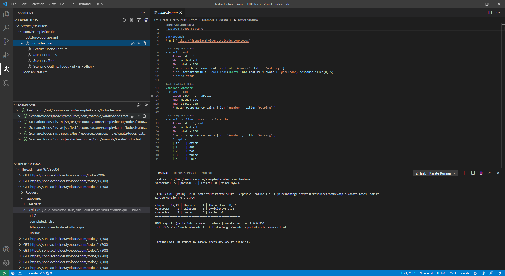
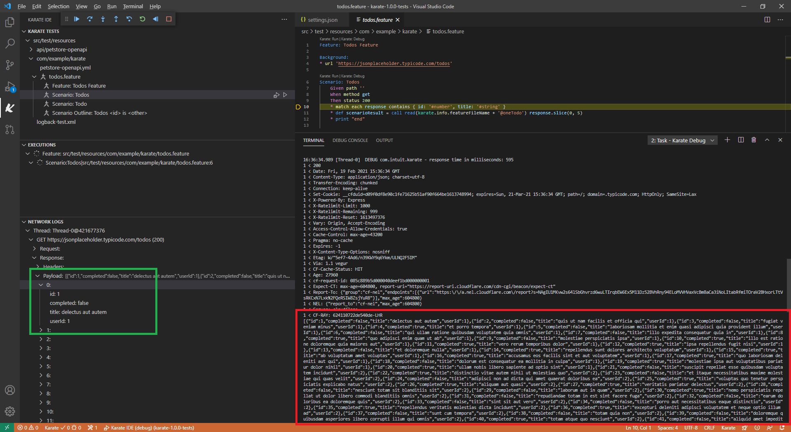
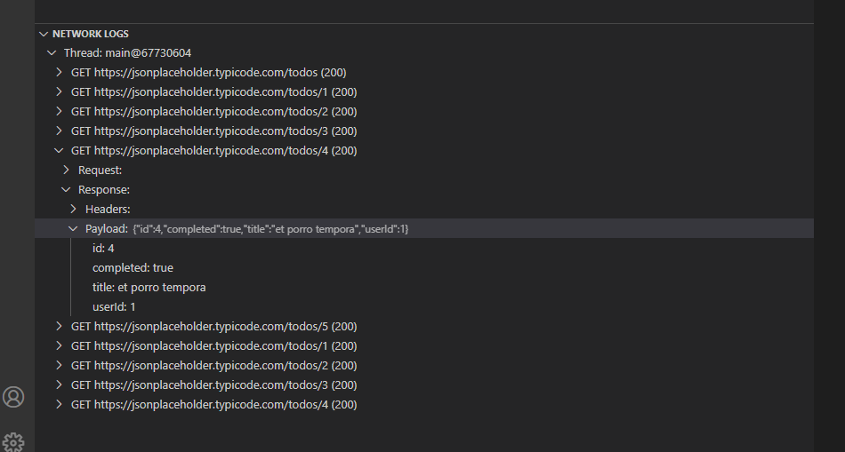
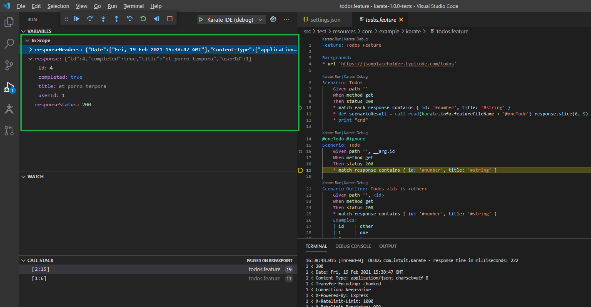
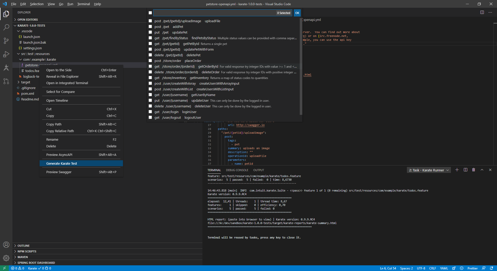
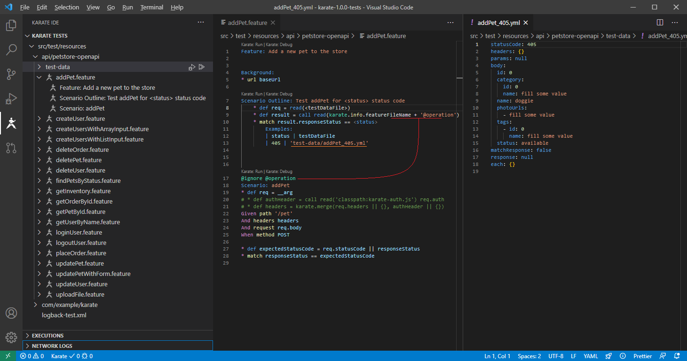
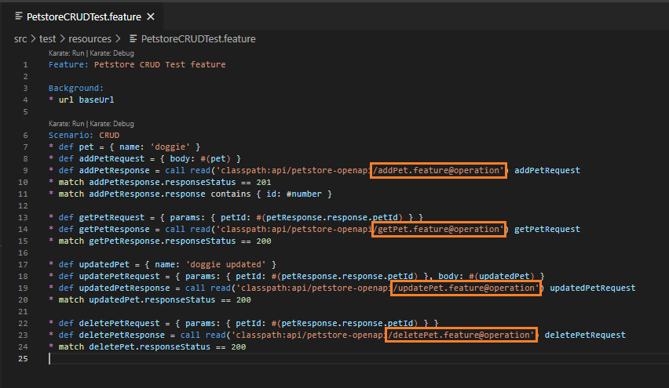

# Karate IDE

Explore your APIs and Debug [Karate](https://github.com/intuit/karate) test scripts within VS Code.

This is not the official vscode extension. Here you can find the original [Karate Runner](https://github.com/kirksl/karate-runner/)

It features: 
- **code generation** from openapi definitions for both **tests** and **mocks** (server side features), 
- running your tests and starting your mocks from a menu, 
- **tree-like http log viewer** like you would expect in Postman or chrome-dev-tools, 
- visualize logs belonging to individual features/scenarios as *OutputChannel*s, 
- copy http request logs as cURL and smart paste of cURL commands as test Scenarios, 
- code navigation between local and classpath files (it honors your [classpath setting](#karate-classpath)) with _control-click_,
- switch _karate.env_ from the UI, 
- focus on tests by name and @tag, **autocompletion** of classpath features and feature tags...
- colorize logs with extensions like [Output Colorizer](https://marketplace.visualstudio.com/items?itemName=IBM.output-colorizer)

This VS Code extension is only compatible with Karate 1.0.0+ while [Karate Runner](https://github.com/kirksl/karate-runner/) remains compatible with all versions of Karate.

We can configure vscode [classpath setting](#karate-classpath) for you using **"Configure Karate-IDE karate classpath"** command from Command Palette (View > Command Palette or Ctrl+Shift+P) so you don't need to ;-)

<!-- TOC -->

- [Karate IDE](#karate-ide)
    - [Debug Karate Scripts](#debug-karate-scripts)
    - [Explore your APIs](#explore-your-apis)
        - [Structured HTTP Log Viewer](#structured-http-log-viewer)
        - [Structured tree-like json variables in debuger](#structured-tree-like-json-variables-in-debuger)
        - [Generating Code from OpenAPI definitions](#generating-code-from-openapi-definitions)
            - [Generating Test Features from OpenAPI definitions](#generating-test-features-from-openapi-definitions)
            - [Reusing generated Scenarios in complex flow/squence tests](#reusing-generated-scenarios-in-complex-flowsquence-tests)
            - [Generating complete Mocks from OpenAPI definitions](#generating-complete-mocks-from-openapi-definitions)
        - [Generating Code from cURL Smart Paste](#generating-code-from-curl-smart-paste)
        - [Generating Mocks from cURL commands output Smart Paste](#generating-mocks-from-curl-commands-output-smart-paste)
    - [Other functionality](#other-functionality)
        - [Karate.env switcher](#karateenv-switcher)
        - [Tests Filtering / Focus](#tests-filtering--focus)
        - [Code Navigation and Definition Peek](#code-navigation-and-definition-peek)
        - [Auto-Completion](#auto-completion)
        - [Start your Mocks server from a menu](#start-your-mocks-server-from-a-menu)
    - [Configuration](#configuration)
        - [vscode/launch.json](#vscodelaunchjson)
        - [Karate classpath](#karate-classpath)
            - [Using karate.jar Karate fat jar](#using-karatejar-karate-fat-jar)
            - [Using maven repository dependencies](#using-maven-repository-dependencies)
            - [With jBang](#with-jbang)
        - [Run/Debug command templates](#rundebug-command-templates)

<!-- /TOC -->
## Debug Karate Scripts

You can Debug [Karate](https://github.com/intuit/karate) scripts, using:

-   set breakpoints
-   step-by-step debuging
-   navigate scenario call stack with their variables
-   inspect and copy variables, values or their json path expression
-   interactive debug console where you can print, update variable values or test jsonPath expressions
-   hot reloading (with caveants)

It includes DebugAdapter originaly developed by [Peter Thomas](https://github.com/intuit/karate/) and [Kirk Slota](https://github.com/kirksl/karate-runner/).

https://twitter.com/KarateDSL/status/1167533484560142336

## Explore your APIs

Now you can also explore your API from within VS Code. Karate is (one of) the best API testing automation tools.

With this extension you can leverage your existing scripts to explore your API while you developing your test scripts. No need to maintain a separate collection or switch between different programs.

You can also use this extension to generate reusable tests scripts from OpenAPI and cURL to speed up your development and api exploration.



### Structured HTTP Log Viewer

Forget about reading response payload from text log files.





### Structured (tree-like) json variables in debuger

With Karate 1.0.0+ you can inspect debuger variables as an structured tree, not just like json strings:



### Generating Code from OpenAPI definitions

#### Generating Test Features from OpenAPI definitions

To quickly test/explore your APIs you can generate reusable karate scenarios from your openapi definitions, with test-data yml files.





#### Reusing generated Scenarios in complex flow/squence tests

This generated scenarios can be reused and invoked from inside other tests, implementing more complex sequences or flows.

You don't need to keep writting http based scenarios but directly reference your API operations by the very name they are documented in your OpenAPI definition.



#### Generating complete Mocks from OpenAPI definitions

You can also generate Mock features for your complete api from openapi definitions. Right click in a openapi yml file and select `Generate Karate Mocks`.
### Generating Code from cURL (Smart Paste)

If a `curl` command is detected while pasting into feature files it will be transformed into Karate syntax and pasted into the VSCode Editor.

### Generating Mocks from cURL commands output (Smart Paste)

If a `curl` command... TODO

## Other functionality

### Karate.env switcher

You can switch karate.env from the grear icon on tests tree view. When using Karate-IDE for manual testing or exploring APIs you will find very handy this environment switcher.

### Tests Filtering / Focus

You have two different ways to filter files that appears on Tests Tree View: using `karateIDE.tests.globFilter` in settings for global filtering and `Focus` icon for temporal filtering of tests and tags.

In `Focus` you can filter by name pattern and by scenario _@tags_ supporting "or & and" constructions: separate tags by comma for AND, quote them for OR and prefix the with ~@ for NOT.
### Code Navigation and Definition Peek

You can navigate between files, features and scenario @tags using `Control-Click` or _peek_ definitions with `Alt+F12`

You can also navigate to scenarios by _@tag_ in the same or in different feature file.

It honors your [classpath](#karate-classpath) setting when navigating to files with `classpath:` prefix.

### Auto-Completion

When reading yml/json files are calling other features you can autocomplete their names with teh list of local and classpath files.

It honors your [classpath](#karate-classpath) setting when navigating to files with `classpath:` prefix.

### Start your Mocks server from a menu

Right click on a *.feature file and click `Start Karate Mock Server`

## Configuration

### .vscode/launch.json

When you click `Karate Debug` for the first time if `.vscode/launch.js` does not exist one will be created for you with this contents. This is a one time step, after this file is created you can start debuging normally.

```json
{
    "version": "0.2.0",
    "configurations": [
        {
            "type": "karate-ide",
            "name": "Karate IDE (debug)",
            "request": "launch"
        }
    ]
}
```

### Karate classpath

To run Karate features you need to download Karate "fat" jar from [Karate Release](https://github.com/intuit/karate/releases) page or if you are using maven refer to jars already present in you maven local repository.

We can configure this classpath setting for you using **"Configure Karate-IDE karate classpath"** command from Command Palette (View > Command Palette or Ctrl+Shift+P)

Karate-IDE will honor your classpath settings when autocompleting and navigating/peeking code with `classpath:` prefix.

#### Using karate.jar (Karate fat jar)

Download the latest executable form https://github.com/intuit/karate/releases and rename it to your project's root folder as `karate.jar` and you are done.

Alternatively you can download it to a different location and configure where your karate.jar is located in, globabaly in  `File > Preferences > Settings` or for your current project in `.vscode/settings.json`.

```json
{
    "karateIDE.karateCli.classpath": "src/test/resources;<path to your file>/karate.jar"
}
```

Use **"Configure Karate-IDE karate classpath"** command from Command Palette (View > Command Palette or Ctrl+Shift+P).

#### Using maven repository dependencies

If you are already using maven and karate dependencies are already present in your maven local repository, you can use `${m2.repo}` to build a classpath and KarateIDE will replace this at runtime with the value of `${home}/.m2/repository`. 

Please, use **"Configure Karate-IDE karate classpath"** command from Command Palette and we will configure this for you so you don't need to.

```json
{
    // full classpath example for for karate 1.0.1 version in windows
    "karateIDE.karateCli.classpath": "src/main/resources;src/test/resources;target/classes;target/test-classes;${m2.repo}/com/intuit/karate/karate-core/1.0.1/karate-core-1.0.1.jar;${m2.repo}/org/graalvm/js/js-scriptengine/21.0.0/js-scriptengine-21.0.0.jar;${m2.repo}/org/graalvm/sdk/graal-sdk/21.0.0/graal-sdk-21.0.0.jar;${m2.repo}/org/graalvm/js/js/21.0.0/js-21.0.0.jar;${m2.repo}/org/graalvm/regex/regex/21.0.0/regex-21.0.0.jar;${m2.repo}/org/graalvm/truffle/truffle-api/21.0.0/truffle-api-21.0.0.jar;${m2.repo}/com/ibm/icu/icu4j/67.1/icu4j-67.1.jar;${m2.repo}/ch/qos/logback/logback-classic/1.2.3/logback-classic-1.2.3.jar;${m2.repo}/ch/qos/logback/logback-core/1.2.3/logback-core-1.2.3.jar;${m2.repo}/org/slf4j/slf4j-api/1.7.25/slf4j-api-1.7.25.jar;${m2.repo}/org/slf4j/jcl-over-slf4j/1.7.25/jcl-over-slf4j-1.7.25.jar;${m2.repo}/com/jayway/jsonpath/json-path/2.5.0/json-path-2.5.0.jar;${m2.repo}/net/minidev/json-smart/2.3/json-smart-2.3.jar;${m2.repo}/net/minidev/accessors-smart/1.2/accessors-smart-1.2.jar;${m2.repo}/org/ow2/asm/asm/5.0.4/asm-5.0.4.jar;${m2.repo}/info/cukes/cucumber-java/1.2.5/cucumber-java-1.2.5.jar;${m2.repo}/info/cukes/cucumber-core/1.2.5/cucumber-core-1.2.5.jar;${m2.repo}/org/yaml/snakeyaml/1.27/snakeyaml-1.27.jar;${m2.repo}/de/siegmar/fastcsv/1.0.4/fastcsv-1.0.4.jar;${m2.repo}/info/picocli/picocli/4.5.2/picocli-4.5.2.jar"
}

```

If you need to add **extra classpath jars** you can use `mvn dependency:build-classpath` for generating a compatible extended classpath.

#### With jBang

While using karate installed with jBang is supported, please note this is for **advanced users only** and is not recommended for general usage.

First you need to install karate with jbang: 

```sh
jbang alias add --name karate com.intuit.karate:karate-core:<karate version>
``` 

or if jbang is not installed 

```sh
curl -Ls https://sh.jbang.dev | bash -s - alias add --name karate com.intuit.karate:karate-core:<karate version>
```

Now you have to update [Run/Debug command templates](#rundebug-command-templates) for using karate with jbang.

```json
"karateIDE.karateCli.debugCommandTemplate": "jbang karate '-Dkarate.env=${karateEnv}' '-Dvscode.port=${vscodePort}' -d"
"karateIDE.karateCli.runCommandTemplate": "jbang karate '-Dkarate.env=${karateEnv}' '-Dvscode.port=${vscodePort}' ${karateOptions} '${feature}'"
"karateIDE.karateCli.mockServerCommandTemplate": "jbang karate -m '${feature}' -p ${port}"
```
### Run/Debug command templates

For advanded users, Karate-IDE offers _template_ configurations for both Run and Debug commands. Variables with *${}* will be replaced by KarateIDE runtime with actual values.

```json
{
    "karateIDE.karateCli.runCommandTemplate": "java '-Dkarate.env=${karateEnv}' '-Dvscode.port=${vscodePort}' -cp '${classpath}' com.intuit.karate.Main ${karateOptions} '${feature}'",
    "karateIDE.karateCli.debugCommandTemplate": "java '-Dkarate.env=${karateEnv}' '-Dvscode.port=${vscodePort}' -cp '${classpath}' com.intuit.karate.Main -d"
}
```

There is also `${KarateTestRunner}` template variable if you want to build a command line for JUnit tests.

**Enjoy!**
